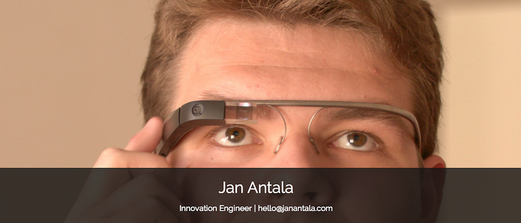

Hello there!

I am an **Innovation Engineer** based in [Bratislava, Slovakia](https://www.google.com/maps/search/Bratislava,+Slovakia). I love making things and helping other people make things. I like **Open Source** and have contributed pieces to a number of [projects](https://github.com/angular-adaptive).

I am passionate about **JavaScript and Mobile Technologies**. I aim to craft apps that adapt beautifully on every device, from smartphones and wearable devices to cars and TVs.

I also like to talk and tweet about it. Check out my [talk slides](http://www.janantala.com/slides), [writings](http://janantala.github.io/beyond-adaptive-web-design/) and feel free to [drop me a line](mailto:hello@janantala.com).

## Experience

- **Innovation Engineer** *(April 2014 - Present)*
  - VIAMO, a. s. feat. Apptives, s. r. o.
  - *Viamo* service provides secure mobile payments. I've been defining and developing new concepts of **cutting-edge mobile technologies** in preproduction Viamo mobile applications for *iOS and Android*.
- **Web Engineer** *(May 2012 - Present)*
  - Apptives, s. r. o.
  - I've been developing **hybrid mobile applications**, **mobile web** and **restful backend** services using *MEAN stack (MongoDB, ExpressJS, AngularJS, NodeJS)*.
- **Web developer** *(2011 - September 2012)*
  - Freelancer
  - Contract **front-end** and **mobile web** developing in *Backbone.js and jQuery*.

#### Open Source contributions

- **Angular Adaptive** *(March 2013 - Present)*
  - I've been managing organization and developing **alternative control methods** (using *voice commands, device motion and web camera motion*) and **adaptive web components** for *AngularJS* applications.
- **OZ United** *(September 2012 - Present)*
  - I've been doing web developement and voluntary work at the nonprofit organization.
- **many more projects available on GitHub**
  - Various front-end libraries, polyfills, web components...

#### Talks

- **Adaptive Web Design** *(Bratislava, 11th June 2014)*
  - FIIT STU
- **Beyond Adaptive Web Design** *(Bratislava, 29th April 2014)*
  - IIT.SRC 2014
- **How to build an open source AngularJS module** *(Bratislava, 5th December 2013)*
  - WebElement #25 feat. Slovak AngularJS #3
- **Re-Imagining User Interface** *(Bratislava, 23rd April 2013)*
  - IIT.SRC 2013, TP Cup Competition

## Education

- **Master of Engineering (MEng), Information Systems** *(2012 - 2014)*
  - Faculty of Informatics and Information Technologies, Slovak University of Technology in Bratislava
  - Master's thesis: *Adaptive Web Design*
- **Bachelor of Engineering (BEng), Informatics** *(2009 - 2012)*
  - Faculty of Informatics and Information Technologies, Slovak University of Technology in Bratislava
  - Bachelor's thesis: *Developing Rich Internet Applications for Mobile Devices*

## Languages

- **English** - Professional working proficiency
- **German** - Elementary proficiency
- **Slovak** - Native proficiency
